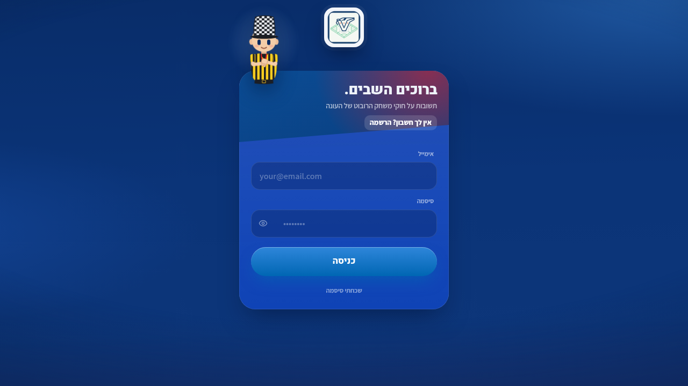

<p align="center">
  
</p>

<h1 align="center">שופט וירטואלי | Boeing727</h1>

<p align="center" dir="rtl">
  אפליקציית ווב שעונה על שאלות חוקים של FIRST LEGO League לפי חוברת החוקים של העונה
  <br />
  <a href="https://fllref.abrdns.com"><strong>https://fllref.abrdns.com</strong></a>
</p>

<p align="center">
  <a href="https://react.dev"></a>
  <a href="https://firebase.google.com"></a>
  
</p>

<p align="center">
  
</p>

<p align="center">
  
</p>

<div dir="rtl">

## מה האפליקציה עושה

- עונה על שאלות חוקים וניקוד לפי עמודי החוברת הרשמית, עם ציטוט של מספרי החוקים והניקוד המדויק.
- שופטת תמונות מהזירה: מצלמים את הרובוט או את מצב המשימה, ומנוע ה-AI מזהה את המשימה ופוסק לפי החוברת.
- עובדת ב-12 שפות, כולל עברית מלאה (RTL).
- מזהה אוטומטית את העונה לפי החוברת שהועלתה (צבעים, שם וסמל).
- כוללת מסך ניהול לבעלים: תיקוני שופט שדורסים את החוברת, יומן שאלות, פידבק משתמשים, אנליטיקס והעלאת חוברת.

## איך זה בנוי

- **לקוח בלבד**: React + TypeScript + Vite, בלי שרת אפליקציה.
- **Firebase**: Authentication (כניסה עם Google), Firestore (הגדרות, מכסות, יומן), Realtime Database (נוכחות ויומן שאלות), Storage.
- **Cloudflare R2**: אחסון עמודי החוברת כתמונות.
- **מנוע השופט**: קוד צד-לקוח שמרכיב את הבקשה (חוברת, תמונות, היסטוריה, תיקוני שופט) ומחזיר תשובה בזרימה חיה, עם מאגר מפתחות וניסיונות חוזרים אוטומטיים כדי שהתשובה תגיע גם בעומס.
- כל הקוד הכבד (AI, המרת PDF, ניהול) נטען רק כשצריכים אותו, כדי שהדף יפתח מהר.

מבנה מפורט של הקוד והחוקים לשינויים בטוחים: [ARCHITECTURE.md](ARCHITECTURE.md).

## אבטחה ופרטיות

- כללי האבטחה של Firebase (`firestore.rules`, `database.rules.json`, `storage.rules`) הם גבול ההרשאות; מסכי הניהול הם נוחות בלבד.
- מכסת שאלות יומית נאכפת בצד הנתונים.
- מדיניות הפרטיות והתנאים מוצגים באפליקציה עצמה (`/privacy`).

## פיתוח מקומי

```bash
npm ci --ignore-scripts
npm run dev      # שרת פיתוח
npm run lint     # בדיקת טיפוסים (TypeScript strict)
npm test         # מבחני היחידה והקומפוננטות (node --test)
npm run build    # בנייה ל-production לתיקיית dist
```

האתר סטטי ומתארח ב-Netlify מתיקיית `dist` (ההפניות וה-headers ב-`public/_redirects` ו-`public/_headers`). כללי האבטחה של Firebase מופצים מ-`firebase.json`.

</div>
